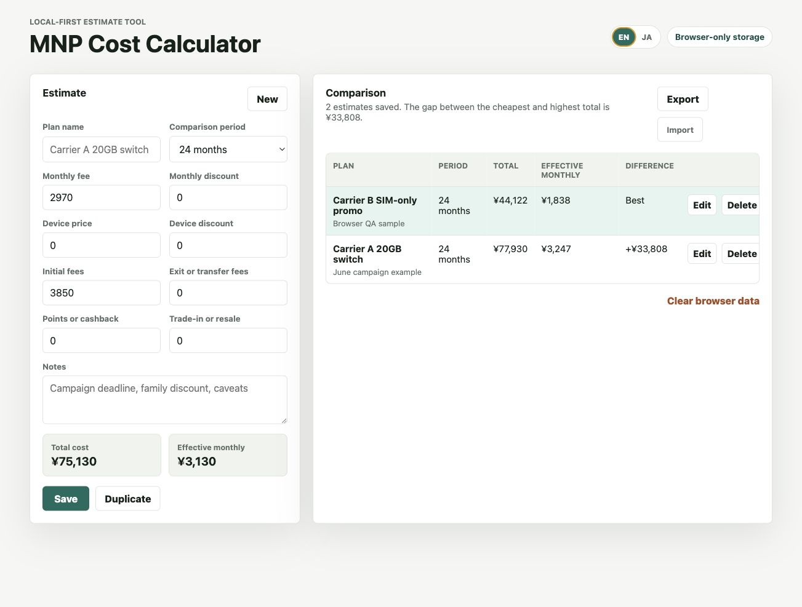

# MNP Cost Calculator

MNP Cost Calculator is a local-first browser tool for comparing Japanese mobile
plan switching costs, including MNP offers, device discounts, fees, points, and
trade-in assumptions.

It calculates total cost and effective monthly cost across a chosen comparison
period. Estimates are saved only in the browser with `localStorage`; there is no
server, login, analytics, tracking, or external API.

Live site: <https://weekendphotogear.github.io/mnp-cost-calculator/>



## Why this matters

Japanese mobile carrier switching offers can be hard to compare because the real
cost depends on monthly fees, temporary discounts, device payments, initial
fees, points, cashback, trade-in value, and the period being compared.

Many comparison tools are either spreadsheet-based, ad-heavy, or opaque about
where entered data goes. This project keeps the tool simple and inspectable:
plain static files, no account, and no server-side data collection.

## Features

- Compare 12, 24, 36, or 48 month totals.
- Include monthly fees, monthly discounts, device costs, fees, points, and trade-in.
- Save multiple estimates in the browser.
- Switch between English and Japanese UI.
- Export and import estimates as JSON.
- Works as a static site by opening `index.html`.

## Development

No build step is required.

```bash
python3 -m http.server 8765
```

Then open <http://127.0.0.1:8765/>.

## Privacy

All estimate data stays in the current browser unless you export it manually.
Clearing site data or browser storage removes saved estimates.

See [PRIVACY.md](PRIVACY.md) for details.

## Maintainer workflow

- Changes should keep the app dependency-free unless there is a strong reason.
- Privacy-sensitive changes should be reviewed against [SECURITY.md](SECURITY.md).
- Usability and accessibility improvements should work on mobile first.
- Release notes should state whether storage format or import/export behavior changed.

## Roadmap

See [ROADMAP.md](ROADMAP.md).

## License

MIT
